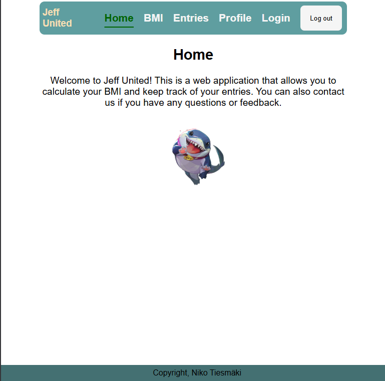
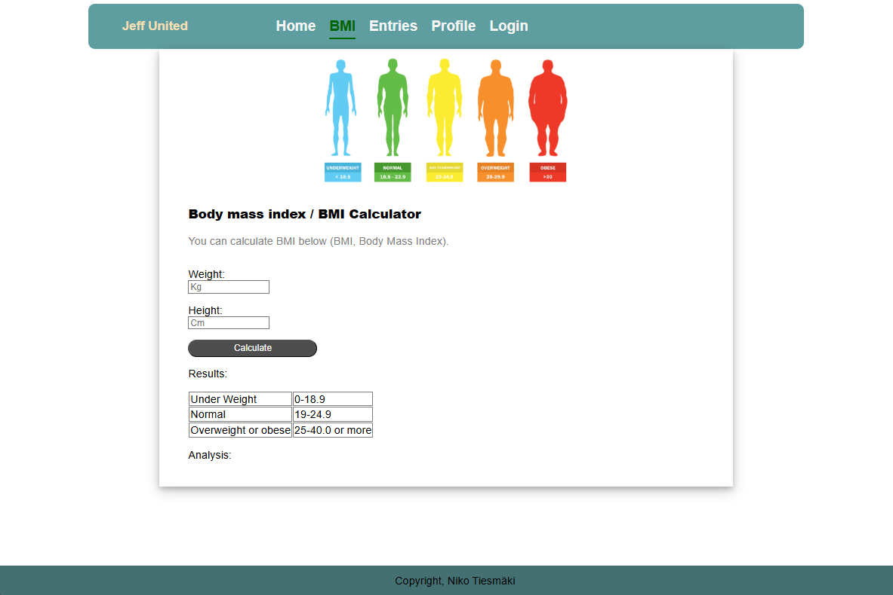
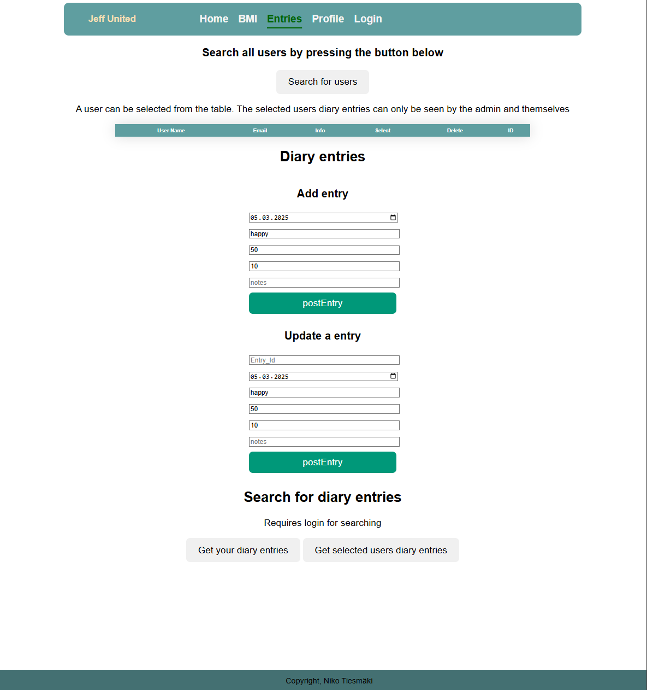
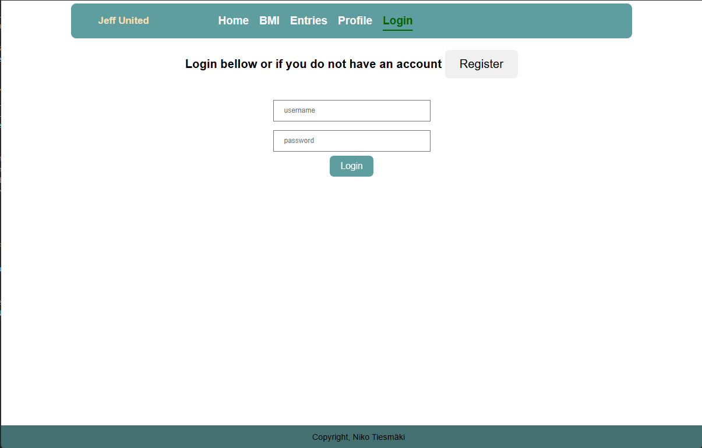
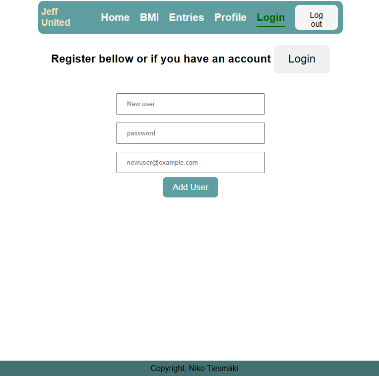
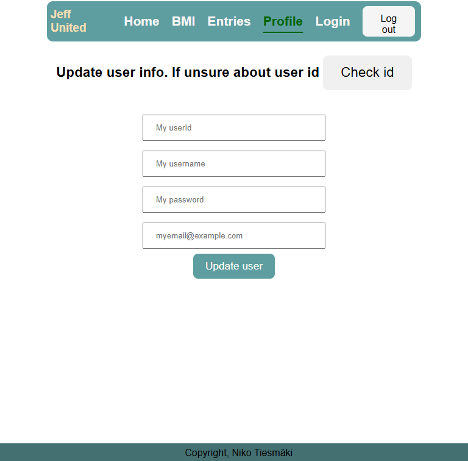
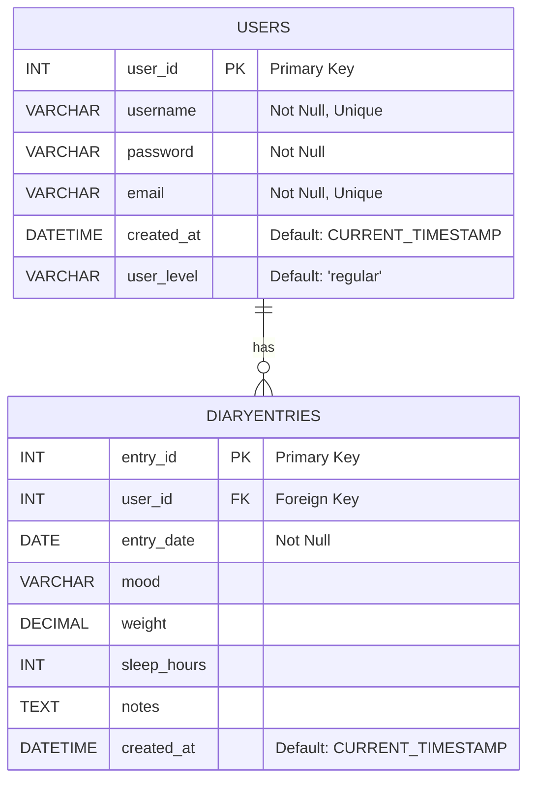

# Yksilöprojekti

Tässä readme tiedostossa käydään läpi kurssin yksilöprojekti. Ensimmäisenä näkyy sovelluksen käyttöliittymästä otetut kuvankaappaukset.

## Kuvankaappaukset

## Linkit Backendiin ja Frontendiin

Molemmat pyörivät localhost palvelimella. Testauksessa käytetyt osoitteet http://localhost:5137/ & http://localhost:3000. API dokumentaatio löytyy suoraan API:n juuresta eli http://localhost:3000.

## Tietokannan kuvaus

Tietokanta koostuu kahdesta taulusta. Users taulun Primary key on diaryentries taulun foreing key. Alla näkyy tietokannasta piirretty kuvas mermaidin avulla.

## Kuvas toiminnallisuuksista
 
### Käyttäjät

1. Lisääminen
2. Poistaminen
3. Kirjautuminen
4. Omien tietojen hakeminen
5. Käyttäjien hakeminen id:llä
6. Kaikkien käyttäjien hakeminen

### Päiväkirjamerkinnät

1. Merkintöjen lisääminen
2. Merkintöjen poistaminen
3. Merkintöjen muokkaaminen
4. Merkintöjen tarkasteleminen

### Admin

1. Muiden käyttäjien muokkaaminen
2. Muiden merkintöjen muokkaaminen
3. Muiden merkintöjen poistaminen
4. Muiden käyttäjien poistaminen
5. Muiden merkintöjen tarkasteleminen

## Bugit

**Tiedossa olevat bugit tällä hetkellä on:**

Päiväkirjan poistaessa fetchData funktio vastaa errorilla (Mahdollisesti lähettää delete pyynnön 2 kertaa?)
## Referenssit

**Projektin tekemisessä käytetty ongelmien ratkaisuiden etsimiseen:**

  W3schools  
  StackOverFlow  
  Opettajien materiaalit  

**API dokumentaatiota luodessa käytetty:**

Microsoft copilot käytetty apuna kommentoimisessa.  
ApiDoc dokumentaatiota  
Opettajan materiaalia dokumentaatiosta.
